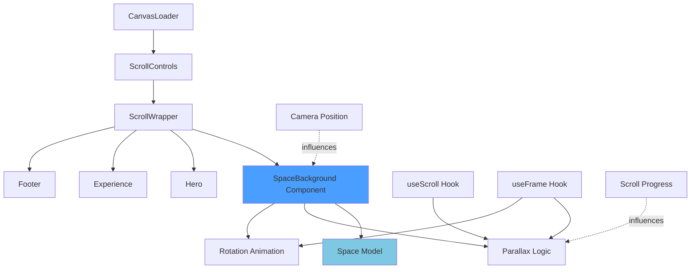
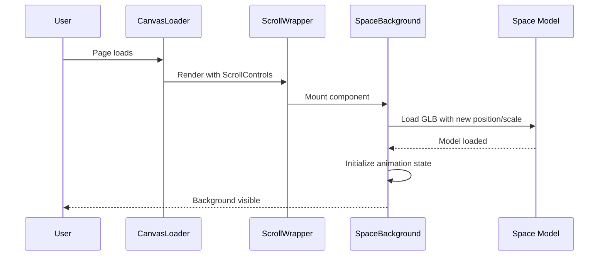
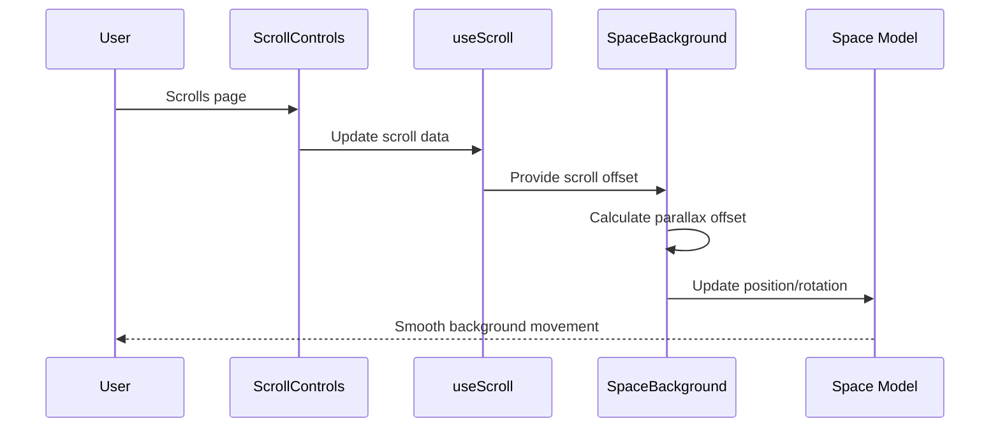

# Design Document: Space Background Enhancement

## Overview

The "need some space" GLB model is currently positioned far from the camera (position: [-50, -200, -50]) with large scale (250), making it barely visible in the scene. This design enhances the space model to serve as a prominent, immersive background throughout the portfolio site by repositioning it closer to the camera, adding subtle animations, and ensuring it remains visible across all scroll positions while maintaining visual hierarchy with foreground content.

The enhancement will transform the static, distant particle field into a dynamic, parallax-enabled background that responds to scroll and mouse movement, creating depth and visual interest without overwhelming the primary content (hero text, window model, experience section, footer).

## Architecture



## Sequence Diagrams

### Initialization Flow



### Scroll Interaction Flow



## Components and Interfaces

### Component 1: SpaceBackground

**Purpose**: Manages the space particle field as an animated background layer with parallax scrolling and subtle rotation

**Interface**:
```typescript
interface SpaceBackgroundProps {
  basePosition?: [number, number, number]
  baseScale?: number
  parallaxIntensity?: number
  rotationSpeed?: number
  enableParallax?: boolean
  enableRotation?: boolean
}

export function SpaceBackground(props: SpaceBackgroundProps): JSX.Element
```

**Responsibilities**:
- Render the Space model with optimized positioning for background visibility
- Apply parallax effect based on scroll progress
- Apply subtle continuous rotation for visual interest
- Ensure background stays behind foreground content (z-index via positioning)
- Respond to mouse movement for subtle interactive parallax (optional)

**Default Props**:
```typescript
const defaultProps: Required<SpaceBackgroundProps> = {
  basePosition: [0, -50, -100],
  baseScale: 180,
  parallaxIntensity: 0.3,
  rotationSpeed: 0.05,
  enableParallax: true,
  enableRotation: true
}
```

### Component 2: Space (Enhanced)

**Purpose**: Render the GLB particle field model with optional material enhancements

**Current Interface**:
```typescript
export function Space(props: JSX.IntrinsicElements['group']): JSX.Element
```

**Potential Enhancement** (optional):
```typescript
interface SpaceProps extends JSX.IntrinsicElements['group'] {
  opacity?: number
  pointSize?: number
  color?: string
}
```

**Responsibilities**:
- Load and render the need_some_space.glb model
- Apply material properties to particle system
- Maintain performance with large particle count

## Data Models

### SpaceAnimationState

```typescript
interface SpaceAnimationState {
  currentRotation: {
    x: number
    y: number
    z: number
  }
  parallaxOffset: {
    x: number
    y: number
    z: number
  }
  scrollProgress: number
  mouseInfluence: {
    x: number
    y: number
  }
}
```

**Validation Rules**:
- All rotation values must be in radians
- parallaxOffset values must be finite numbers
- scrollProgress must be between 0 and 1
- mouseInfluence values must be between -1 and 1

### SpaceBackgroundConfig

```typescript
interface SpaceBackgroundConfig {
  basePosition: [number, number, number]
  baseScale: number
  parallaxIntensity: number
  rotationSpeed: number
  enableParallax: boolean
  enableRotation: boolean
}
```

**Validation Rules**:
- basePosition must be a tuple of 3 finite numbers
- baseScale must be positive number
- parallaxIntensity must be between 0 and 1
- rotationSpeed must be positive number (typically 0.01 to 0.1)
- boolean flags must be true or false

## Key Functions with Formal Specifications

### Function 1: calculateParallaxOffset()

```typescript
function calculateParallaxOffset(
  scrollProgress: number,
  basePosition: [number, number, number],
  intensity: number
): [number, number, number]
```

**Preconditions:**
- `scrollProgress` is a number between 0 and 1 (inclusive)
- `basePosition` is a valid 3D coordinate tuple
- `intensity` is a number between 0 and 1 (inclusive)

**Postconditions:**
- Returns a valid 3D coordinate tuple
- Returned values are finite numbers
- When `scrollProgress === 0`, offset is minimal
- When `scrollProgress === 1`, offset is maximal based on intensity
- Offset magnitude is proportional to `intensity` parameter

**Loop Invariants:** N/A (no loops)

### Function 2: updateRotation()

```typescript
function updateRotation(
  currentRotation: { x: number; y: number; z: number },
  rotationSpeed: number,
  delta: number
): { x: number; y: number; z: number }
```

**Preconditions:**
- `currentRotation` contains valid radian values
- `rotationSpeed` is a positive number
- `delta` is the frame time delta (positive number, typically 0.016 for 60fps)

**Postconditions:**
- Returns updated rotation object with valid radian values
- Rotation values are continuous and smooth
- Rotation change is proportional to `delta` (frame-rate independent)
- No rotation value exceeds 2π before normalization

**Loop Invariants:** N/A (no loops)

### Function 3: applyMouseInfluence()

```typescript
function applyMouseInfluence(
  baseOffset: [number, number, number],
  mousePosition: { x: number; y: number },
  influenceStrength: number
): [number, number, number]
```

**Preconditions:**
- `baseOffset` is a valid 3D coordinate tuple
- `mousePosition.x` and `mousePosition.y` are between -1 and 1
- `influenceStrength` is between 0 and 1

**Postconditions:**
- Returns modified 3D coordinate tuple
- Returned values are finite numbers
- When `influenceStrength === 0`, returns `baseOffset` unchanged
- Mouse influence is subtle and proportional to `influenceStrength`

**Loop Invariants:** N/A (no loops)

## Algorithmic Pseudocode

### Main Animation Loop Algorithm

```typescript
// Executed every frame via useFrame hook
function animateSpaceBackground(
  state: RootState,
  delta: number,
  scrollData: ScrollData,
  config: SpaceBackgroundConfig,
  groupRef: React.RefObject<THREE.Group>
): void {
  // Precondition: groupRef.current is not null
  if (!groupRef.current) return
  
  const group = groupRef.current
  const scrollProgress = scrollData.offset
  
  // Step 1: Calculate parallax offset based on scroll
  if (config.enableParallax) {
    const parallaxY = scrollProgress * config.parallaxIntensity * 50
    const parallaxZ = scrollProgress * config.parallaxIntensity * 20
    
    group.position.y = config.basePosition[1] + parallaxY
    group.position.z = config.basePosition[2] + parallaxZ
  }
  
  // Step 2: Apply continuous rotation
  if (config.enableRotation) {
    group.rotation.y += config.rotationSpeed * delta
    group.rotation.x += (config.rotationSpeed * 0.5) * delta
    
    // Normalize rotation to prevent overflow
    if (group.rotation.y > Math.PI * 2) {
      group.rotation.y -= Math.PI * 2
    }
    if (group.rotation.x > Math.PI * 2) {
      group.rotation.x -= Math.PI * 2
    }
  }
  
  // Step 3: Apply subtle mouse influence (optional)
  const mouseInfluenceX = state.pointer.x * 2
  const mouseInfluenceY = state.pointer.y * 2
  
  group.position.x = config.basePosition[0] + mouseInfluenceX
  
  // Postcondition: group position and rotation are updated smoothly
}
```

**Preconditions:**
- `groupRef.current` exists and is a valid THREE.Group
- `delta` is positive frame time
- `scrollData` contains valid scroll offset (0 to 1)
- `config` contains validated configuration values

**Postconditions:**
- Group position is updated based on scroll and mouse
- Group rotation is updated smoothly
- All transformations are frame-rate independent
- No NaN or Infinity values in position/rotation

**Loop Invariants:** N/A (single execution per frame)

### Parallax Calculation Algorithm

```typescript
function calculateParallaxOffset(
  scrollProgress: number,
  basePosition: [number, number, number],
  intensity: number
): [number, number, number] {
  // Precondition checks
  if (scrollProgress < 0 || scrollProgress > 1) {
    throw new Error('scrollProgress must be between 0 and 1')
  }
  if (intensity < 0 || intensity > 1) {
    throw new Error('intensity must be between 0 and 1')
  }
  
  // Calculate offset multipliers
  const yMultiplier = 50 * intensity
  const zMultiplier = 20 * intensity
  
  // Apply parallax effect
  const offsetY = scrollProgress * yMultiplier
  const offsetZ = scrollProgress * zMultiplier
  
  // Return new position
  return [
    basePosition[0],
    basePosition[1] + offsetY,
    basePosition[2] + offsetZ
  ]
  
  // Postcondition: returned values are finite and valid
}
```

**Preconditions:**
- `scrollProgress` ∈ [0, 1]
- `basePosition` is valid 3D coordinate
- `intensity` ∈ [0, 1]

**Postconditions:**
- Returns valid 3D coordinate tuple
- Y and Z offsets are proportional to scroll and intensity
- X position remains unchanged
- All values are finite numbers

**Loop Invariants:** N/A (no loops)

## Example Usage

### Basic Integration

```typescript
// In ScrollWrapper or new layout component
import { SpaceBackground } from './components/SpaceBackground'

function ScrollWrapper(props: { children: React.ReactNode }) {
  return (
    <>
      {/* Background layer - renders first, positioned far back */}
      <SpaceBackground 
        basePosition={[0, -50, -100]}
        baseScale={180}
        parallaxIntensity={0.3}
        rotationSpeed={0.05}
      />
      
      {/* Foreground content */}
      <group>
        {props.children}
      </group>
    </>
  )
}
```

### Custom Configuration

```typescript
// With custom settings for different visual effect
<SpaceBackground 
  basePosition={[0, -30, -80]}
  baseScale={200}
  parallaxIntensity={0.5}
  rotationSpeed={0.02}
  enableParallax={true}
  enableRotation={true}
/>
```

### Disabled Animations

```typescript
// Static background without animations
<SpaceBackground 
  basePosition={[0, -50, -100]}
  baseScale={180}
  enableParallax={false}
  enableRotation={false}
/>
```

### Complete Component Implementation Example

```typescript
'use client'

import { useRef } from 'react'
import { useFrame, useThree } from '@react-three/fiber'
import { useScroll } from '@react-three/drei'
import * as THREE from 'three'
import { Space } from './models/Space'

interface SpaceBackgroundProps {
  basePosition?: [number, number, number]
  baseScale?: number
  parallaxIntensity?: number
  rotationSpeed?: number
  enableParallax?: boolean
  enableRotation?: boolean
}

export function SpaceBackground({
  basePosition = [0, -50, -100],
  baseScale = 180,
  parallaxIntensity = 0.3,
  rotationSpeed = 0.05,
  enableParallax = true,
  enableRotation = true
}: SpaceBackgroundProps) {
  const groupRef = useRef<THREE.Group>(null)
  const scrollData = useScroll()
  const { pointer } = useThree()
  
  useFrame((state, delta) => {
    if (!groupRef.current) return
    
    const group = groupRef.current
    const scrollProgress = scrollData?.offset || 0
    
    // Parallax effect
    if (enableParallax) {
      const parallaxY = scrollProgress * parallaxIntensity * 50
      const parallaxZ = scrollProgress * parallaxIntensity * 20
      
      group.position.y = basePosition[1] + parallaxY
      group.position.z = basePosition[2] + parallaxZ
    }
    
    // Rotation animation
    if (enableRotation) {
      group.rotation.y += rotationSpeed * delta
      group.rotation.x += (rotationSpeed * 0.5) * delta
    }
    
    // Mouse influence
    group.position.x = basePosition[0] + pointer.x * 2
  })
  
  return (
    <group ref={groupRef} position={basePosition}>
      <Space scale={baseScale} />
    </group>
  )
}
```

## Correctness Properties

*A property is a characteristic or behavior that should hold true across all valid executions of a system—essentially, a formal statement about what the system should do. Properties serve as the bridge between human-readable specifications and machine-verifiable correctness guarantees.*

### Property 1: Background Visibility Across Scroll Positions

*For any* scroll position between 0 and 1, the space background should remain visible within the camera frustum.

**Validates: Requirements 2.1, 2.2, 2.3**

### Property 2: Z-Order Preservation

*For any* foreground content element (Hero, Experience, Footer), the space background should render behind that element in 3D space.

**Validates: Requirements 2.4, 11.4**

### Property 3: Valid Configuration Application

*For any* valid configuration props (finite basePosition, positive baseScale, intensity in [0,1], positive rotationSpeed), the SpaceBackground should apply those exact values to the rendering.

**Validates: Requirement 1.3**

### Property 4: Invalid Configuration Fallback

*For any* invalid configuration props (non-finite basePosition, non-positive baseScale, out-of-range intensity, non-positive rotationSpeed), the SpaceBackground should fall back to default values for the invalid props.

**Validates: Requirements 1.4, 7.1, 7.2, 7.3, 7.4**

### Property 5: Parallax Y-Axis Formula

*For any* scroll progress value between 0 and 1 and any intensity value between 0 and 1, when parallax is enabled, the Y-axis offset should equal scroll progress × intensity × 50.

**Validates: Requirements 3.2, 10.6**

### Property 6: Parallax Z-Axis Formula

*For any* scroll progress value between 0 and 1 and any intensity value between 0 and 1, when parallax is enabled, the Z-axis offset should equal scroll progress × intensity × 20.

**Validates: Requirements 3.3, 10.7**

### Property 7: Parallax X-Axis Invariant

*For any* scroll progress value, when parallax is enabled, the X-axis position should remain unchanged by parallax calculations (only affected by mouse influence).

**Validates: Requirement 3.4**

### Property 8: Parallax Disabled Invariant

*For any* scroll progress value, when parallax is disabled, the background position should remain at the base position regardless of scrolling.

**Validates: Requirement 3.5**

### Property 9: Parallax Output Finiteness

*For any* valid scroll progress and intensity values, the parallax calculation should return finite numbers for all three offset components (X, Y, Z).

**Validates: Requirement 10.5**

### Property 10: Rotation Update Formula

*For any* rotation speed and frame delta, when rotation is enabled, the Y-axis rotation should increment by rotationSpeed × delta, and the X-axis rotation should increment by (rotationSpeed × 0.5) × delta.

**Validates: Requirements 4.1, 4.2**

### Property 11: Rotation Normalization

*For any* number of animation frames, when rotation is enabled, rotation values should remain bounded within [0, 2π] through normalization.

**Validates: Requirement 4.3**

### Property 12: Rotation Disabled Invariant

*For any* number of animation frames, when rotation is disabled, the rotation values should remain at their initial values.

**Validates: Requirement 4.4**

### Property 13: Frame-Rate Independence

*For any* two different frame rates (e.g., 30fps vs 60fps), running the animation for the same total time should produce equivalent final positions and rotations.

**Validates: Requirements 4.5, 6.1, 6.2, 6.3**

### Property 14: Mouse Influence on X-Axis

*For any* pointer X coordinate between -1 and 1, the background X-axis position should equal basePosition[0] + (pointerX × 2).

**Validates: Requirements 5.1, 5.2, 5.3, 5.4**

### Property 15: Parallax Input Validation

*For any* scroll progress value outside [0, 1] or intensity value outside [0, 1], the parallax calculation should handle the input gracefully without crashing.

**Validates: Requirements 10.1, 10.2**

## Error Handling

### Error Scenario 1: GLB Model Load Failure

**Condition**: The need_some_space.glb file fails to load or is missing
**Response**: 
- Log error to console with descriptive message
- Render fallback particle system using THREE.Points with basic geometry
- Display warning in development mode only
**Recovery**: 
- Retry loading after 2 seconds (max 3 attempts)
- If all retries fail, continue with fallback rendering

### Error Scenario 2: Invalid Configuration Props

**Condition**: Props contain invalid values (NaN, Infinity, out-of-range)
**Response**:
- Validate props on component mount
- Log warning with invalid prop names
- Fall back to default values for invalid props
**Recovery**:
- Use default configuration for invalid props
- Continue rendering with valid subset of props

### Error Scenario 3: Ref Not Attached

**Condition**: groupRef.current is null during useFrame execution
**Response**:
- Early return from useFrame callback
- No error thrown (normal during initial render)
**Recovery**:
- Ref will attach on next render cycle
- Animation will start automatically once ref is available

### Error Scenario 4: Performance Degradation

**Condition**: Frame rate drops below 30fps consistently
**Response**:
- Detect low frame rate using performance monitoring
- Automatically reduce particle count or disable animations
- Log performance warning
**Recovery**:
- Provide manual override prop to force high-quality mode
- Allow user to re-enable animations if desired

## Testing Strategy

### Unit Testing Approach

**Test Framework**: Jest + React Testing Library + @react-three/test-renderer

**Key Test Cases**:
1. Component renders without crashing with default props
2. Component renders without crashing with custom props
3. Invalid props are validated and fall back to defaults
4. Parallax calculation returns correct offsets for various scroll values
5. Rotation update maintains values within valid range
6. Mouse influence calculation produces bounded results

**Coverage Goals**: 90%+ code coverage for SpaceBackground component

### Property-Based Testing Approach

**Property Test Library**: fast-check

**Properties to Test**:
1. **Parallax Offset Bounds**: For any valid scroll progress and intensity, parallax offset is finite and bounded
2. **Rotation Normalization**: After any number of rotation updates, rotation values remain within [0, 2π]
3. **Frame-Rate Independence**: Animation produces same visual result regardless of delta time variations
4. **Configuration Validation**: Any configuration object either validates successfully or falls back to defaults

**Example Property Test**:
```typescript
import fc from 'fast-check'

test('parallax offset is always finite and bounded', () => {
  fc.assert(
    fc.property(
      fc.float({ min: 0, max: 1 }), // scrollProgress
      fc.float({ min: 0, max: 1 }), // intensity
      (scrollProgress, intensity) => {
        const offset = calculateParallaxOffset(
          scrollProgress,
          [0, -50, -100],
          intensity
        )
        
        return (
          offset.every(v => Number.isFinite(v)) &&
          Math.abs(offset[1]) <= 100 &&
          Math.abs(offset[2]) <= 100
        )
      }
    )
  )
})
```

### Integration Testing Approach

**Test Framework**: Playwright for E2E testing

**Integration Test Cases**:
1. Space background loads and displays on page load
2. Background moves smoothly during scroll interaction
3. Background responds to mouse movement
4. Background remains visible across all sections (Hero, Experience, Footer)
5. Background does not interfere with clickable foreground elements
6. Background animation performance remains acceptable (>30fps)

**Visual Regression Testing**:
- Capture screenshots at scroll positions 0%, 25%, 50%, 75%, 100%
- Compare against baseline images
- Detect unintended visual changes

## Performance Considerations

### Particle Count Optimization
- The need_some_space.glb model contains a large number of particles
- Monitor draw calls and particle count in production
- Consider LOD (Level of Detail) system if performance issues arise on low-end devices

### Animation Performance
- Use useFrame with delta time for frame-rate independent animations
- Avoid expensive calculations inside useFrame (pre-calculate when possible)
- Use THREE.MathUtils.lerp/damp for smooth interpolation instead of direct assignment

### Memory Management
- Preload GLB model using useGLTF.preload() (already implemented)
- Dispose of geometries and materials on unmount
- Monitor memory usage during long sessions

### Mobile Optimization
- Reduce particle count on mobile devices using isMobile detection
- Disable rotation animation on low-end devices
- Reduce parallax intensity on mobile for better performance

### Render Order Optimization
- Ensure space background renders early in the scene graph
- Use renderOrder property if z-fighting occurs
- Consider using a separate render pass for background if needed

## Security Considerations

### Asset Loading
- Validate GLB file integrity on load
- Ensure model file is served from trusted source (local public directory)
- No user-uploaded models (static asset only)

### XSS Prevention
- No user input is rendered in the component
- All props are validated and sanitized
- No dangerouslySetInnerHTML or similar patterns

### Performance-Based DoS
- Implement frame rate monitoring to detect performance attacks
- Automatic quality reduction prevents browser lockup
- No infinite loops or unbounded recursion

## Dependencies

### Required Dependencies (Already Installed)
- `three` (^0.160.0+): Core 3D library
- `@react-three/fiber` (^8.15.0+): React renderer for Three.js
- `@react-three/drei` (^9.92.0+): Useful helpers (useGLTF, useScroll)
- `react` (^18.0.0+): UI library
- `gsap` (^3.12.0+): Animation library (for initial fade-in)

### Optional Dependencies
- `@react-three/test-renderer`: For unit testing Three.js components
- `fast-check`: For property-based testing
- `r3f-perf`: For performance monitoring during development

### Asset Dependencies
- `/public/models/need_some_space.glb`: The space particle field model (already present)

### No Additional External Dependencies Required
- All functionality can be implemented with existing dependencies
- No new npm packages need to be installed
